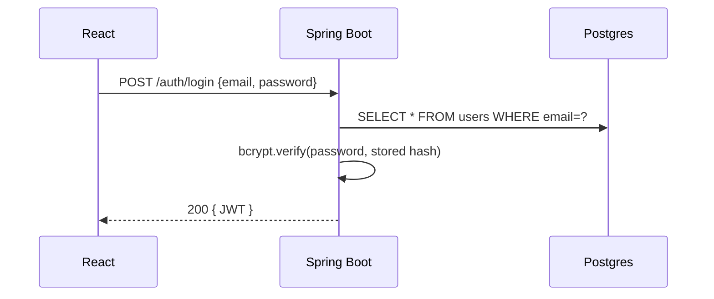
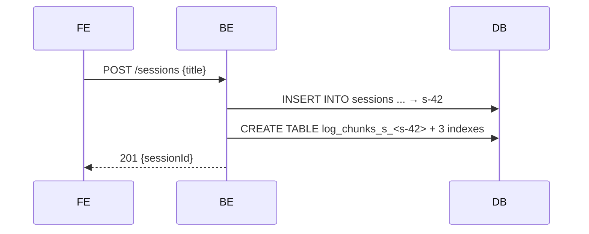
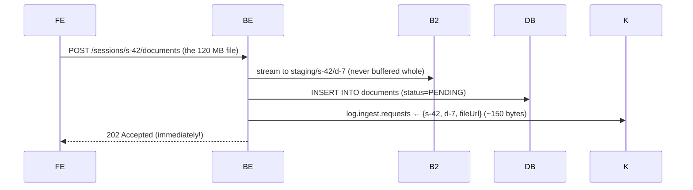
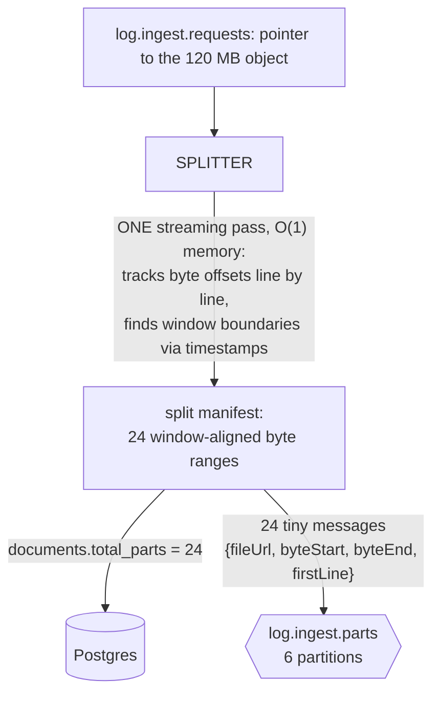
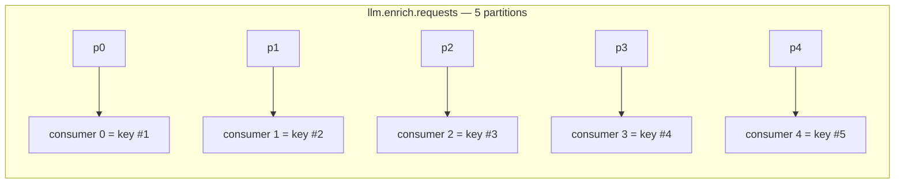
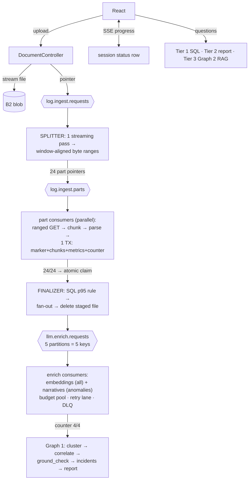

# LogLens Design — End-to-End Walkthrough (study edition)

> **Purpose:** read this once, slowly, and you can explain the whole system in an
> interview — every hop, every table, every decision, and *why the obvious
> alternative was rejected*. Jargon is explained the first time it appears in
> **📖 plain words** boxes, and there's a one-line glossary at the end for review.
>
> **Status note (be honest in interviews):** everything here is live EXCEPT §5–§8's
> partitioned ingest, which is the newest design ([docs/04](04-partitioned-ingest-spec.md),
> implementation in progress). Say "I found the memory ceiling and redesigned ingest
> around split manifests" — never claim it's deployed until it is.

---

## 0. The cast (who runs where, and why that piece exists)

| Component | Tech | Runs on | One-line job |
|---|---|---|---|
| **Frontend** | React | Vercel | upload UI, live progress, report, chat |
| **Backend** | Java / Spring Boot | Render | auth, upload, ALL the Kafka workers, query APIs |
| **Orchestrator** | Python / FastAPI / LangGraph | Render | the two AI "brains": report writing + Q&A |
| **Kafka** | Redpanda Cloud | managed | the conveyor belts between steps |
| **Blob storage** | Backblaze B2 (S3 API) | managed | temporary parking for the raw uploaded file |
| **PostgreSQL + pgvector** | Postgres 16 | Render | THE database — all truth lives here |

> **📖 plain words — Kafka:** a durable message queue. Programs *produce* (add) small
> messages onto named queues called **topics**; other programs *consume* (read) them.
> Each topic is split into **partitions** (independent sub-queues) so several consumers
> can work in parallel — Kafka guarantees each partition is read by exactly ONE consumer
> in a group at a time. Kafka remembers how far each consumer got (the **offset**), so
> after a crash you resume where you left off instead of starting over.
>
> **📖 plain words — blob storage:** a service for storing files ("objects") of any size,
> accessed over HTTP. "S3 API" is the de-facto standard interface for it. The key
> feature we exploit: a **ranged GET** — "give me only bytes 5,000,000–10,000,000 of
> that file."
>
> **📖 plain words — pgvector:** a Postgres extension adding a `vector` column type and
> similarity search over it — the same database that stores your rows can also answer
> "find the most similar text."

**The two golden rules of the whole design:**
1. **The user-facing request path never does heavy work.** Upload returns in
   milliseconds; everything expensive happens *behind* Kafka, asynchronously.
2. **Kafka moves facts, blob moves bytes, Postgres holds truth.** Messages are tiny
   pointers (~150 bytes); file content never travels through Kafka; every result
   lands in Postgres.

---

## 1. The running example

- **User:** `alice@corp.com`
- **Session:** "payments-api — prod — 16 Jul"
- **File:** `payments-api.log` — **120 MB, ~900,000 lines**, covering **10:00 → 10:30**
- At **10:05** there's a real incident: a burst of `SQLException` deadlocks + slow requests.
- Afterwards Alice asks: *"why did checkout fail around 10:05?"*

Two numbers to keep separate in your head (people mix these up):

- **Windows = 30.** A window is **60 seconds of log time** — the unit of *analysis*.
  30 minutes → ~30 windows, regardless of file size.
- **Parts = 24.** A part is **~5 MB of file bytes** — the unit of *I/O and parallelism*.
  120 MB → ~24 parts, regardless of time span.

Parts exist so we never hold much in memory; windows exist so analysis follows the
timeline. One part contains many complete windows.

---

## 2. Login → `users`



- Passwords are stored as **bcrypt hashes**, never plaintext.
- The response is a **JWT** the frontend attaches to every later request
  (`Authorization: Bearer …`).

> **📖 plain words — hash:** a one-way scramble. You can check "does this password
> produce this scramble?" but never un-scramble it back. bcrypt is a deliberately
> *slow* hash, so a stolen database can't be brute-forced quickly.
>
> **📖 plain words — JWT (JSON Web Token):** a signed note from the server saying
> "this is user u-alice, valid until tomorrow." The server keeps no login state in
> memory — it just verifies the signature on each request. That's **stateless** auth:
> any backend instance can serve any request.

**Decision:** *why JWT, not server-side sessions?* Stateless = no shared session
store = horizontal scaling is free. Trade-off: you can't revoke one token early
without extra machinery — acceptable at a 24h expiry.

---

## 3. Create session → a row AND a dedicated table

Creating a session does two things — the second is the most distinctive decision
in the whole design:



**`sessions`** row: `{id=s-42, user_id=u-alice, title, analysis_status=CREATED,
total_windows=0, enriched_windows=0}`. `analysis_status` walks a fixed path —
`CREATED → CHUNKING → PARSING → ENRICHING → CORRELATING → REPORTING → DONE` — and
the progress bar simply displays it.

**`log_chunks_s_<s-42>`** — a brand-new physical table just for this session:

| column | meaning |
|---|---|
| `chunk_id` (PK) | one row = one 60-second window of logs |
| `document_id` | which uploaded file it came from |
| `time_bucket` | which minute this window covers |
| `line_start` / `line_end` | line range in the original file → used for citations |
| `content` | the raw log lines |
| `embedding vector(768)` | the window's "meaning coordinates" — NULL until §9 fills it |
| `is_anomalous` | did the anomaly gate flag this window? |

Three indexes created up front: **HNSW** on `embedding` (semantic search), **GIN**
full-text on `content` (keyword search), B-tree on `time_bucket` (time filters).

> **📖 plain words — embedding:** a list of 768 numbers encoding what a text *means*.
> Texts with similar meaning get nearby number-lists; closeness is measured with
> **cosine similarity**. This is what lets "why did checkout fail?" find a window
> full of `SQLException` lines even though no words match.
>
> **📖 plain words — HNSW index:** a multi-layer "neighbor web" over all vectors.
> A search hops through the web toward your query (thousands of comparisons) instead
> of comparing against every row (millions) — approximate, but fast.
>
> **📖 plain words — GIN full-text index:** the classic keyword index — "which rows
> contain *deadlock*?" answered instantly, no scanning.

**Decision:** *why a table PER SESSION instead of one big shared chunks table?*
Vector search with a filter is a trap: a shared HNSW index searches the whole
company's vectors first and *then* discards other sessions' results (**filtered
ANN**) — recall and speed collapse as the table grows. A per-session table means
every search walks a small web containing ONLY this corpus. Bonuses: physically
zero cross-tenant reads, and deleting a session = `DROP TABLE` (instant). *Ceiling:*
tens of thousands of tables strain Postgres housekeeping — stated exit is hash
partitioning. Table names are built ONLY from validated UUIDs — that's the
SQL-injection guard on the runtime `CREATE TABLE`.

---

## 4. Upload → blob + `documents` row + ONE tiny Kafka message



- `202 Accepted` = "got it, working on it." The browser never waits for processing.
- **Upload idempotency:** a unique constraint on `(session, filename, size)` — re-uploading
  the same file returns the existing row instead of processing twice.
- The Kafka message is sent **after** the DB row commits, so a consumer can never
  see a message for a row that doesn't exist.

> **📖 plain words — idempotent:** safe to do twice — doing it again produces the
> same end state. The property that makes retries harmless.

**Decision 1:** *why blob storage, not Postgres or Kafka, for the file?* Databases
and brokers are terrible file systems: Kafka's default message cap is ~1 MB and its
disks are sized for streams of small records; Postgres bloats. Blob stores are built
for exactly this — big objects, streamed writes, **ranged reads**. This is the
**claim-check pattern**: park the heavy thing, pass a small claim ticket around.

**Decision 2:** *why a Kafka message at all when the URL is already in the
`documents` table?* The message is the **wake-up call, not the data**. Without it,
workers discover work by *polling* — querying the table every few seconds — plus
lock columns so two workers don't grab the same row, plus stale-lock cleanup. We
know the cost precisely because **v1 did exactly that** (`ProcessingJobWorker`,
3-second polls, lease columns) — ~250 lines deleted when Kafka arrived. The broker
pushes work the instant it exists, hands it to exactly one consumer, and remembers
position across crashes.

---

## 5. The SPLITTER — virtual parts (the ingest redesign)

**The problem it solves:** the first implementation read the whole file into memory
(`readAllLines`) and processed it as ONE Kafka record. At 2.4 MB fine; at 2 GB the
JVM dies (**OOM** — out of memory). One record also means one consumer (no
parallelism) and a crash at line 800,000 restarts from line 1.

**The fix — split manifest, "virtual parts":**



The splitter reads the file top-to-bottom **once**, holding only the current line.
It notes "a new 60-second window starts at byte 5,242,912," and every ~5 MB it marks
a **cut at a window boundary**. It writes NOTHING back to blob — each Kafka message
just says: *"process bytes X–Y of the original object; your first line number is N."*

> **📖 plain words — streaming / O(1) memory:** reading a file like a river — look at
> each line as it flows past, keep almost nothing. Memory stays flat whether the file
> is 1 MB or 10 GB. ("O(1)" = constant — doesn't grow with input size.)

**Decision 1:** *why virtual parts (byte ranges) instead of physically cutting the
file into 24 small blob objects?* Physical parts re-write 100% of the bytes —
double storage, double API calls — for zero benefit, since a ranged GET fetches a
slice either way. **We index split points; we don't copy data.** Same idea as input
splits in Hadoop/Spark.

**Decision 2:** *why must cuts land on window boundaries?* A blind "every 5 MB" cut
could slice a 60-second window — or a multi-line stack trace — across two parts.
Cutting only where a new window begins makes every part self-contained, so parts
can be processed in any order, in parallel, with **zero coordination**.

**Decision 3:** *why is the parts topic keyed per-part, not per-document?* Keying by
document would send all 24 parts to one partition = one consumer = no parallelism.
Per-part keys spread them across all 6 partitions.

---

## 6. Part consumers — chunk → parse → flag → ONE safe transaction

Several consumers work the parts topic in parallel. Per part:

1. **Ranged GET** — fetch only bytes X–Y from B2. Memory = one part (~5 MB), never
   the file.
2. **Chunk** — group the part's lines into 60-second windows (`TimeWindowChunker`).
   Multi-line stack traces stay glued to their first line. (Files with no timestamps
   at all fall back to fixed 500-line windows.)
3. **Parse — "Layer 1", deterministic, zero LLM** — every window runs through seven
   regex parsers: SQL (queries, failures, deadlocks), API (endpoints, latencies),
   Errors (exception types), Performance (GC pauses, thread pools), Auth (401/403),
   Traffic (volumes), Lifecycle (restarts, deploys). Output = **exact numbers**:
   the 10:05 window yields `{DATABASE, sql_failures, count=14}` and
   `{PERFORMANCE, http_latency, p95_ms=4200}`. *Numbers are computed, never
   generated* — no LLM ever counts anything in this system.
4. **Local anomaly rules** — flag the window if it contains an exception / OOM /
   deadlock line, or ≥5 WARNs. (The third rule — latency outliers — needs the whole
   corpus, so it waits for §7.)
5. **One short transaction** writes everything atomically:
   - a **marker row** `(document_id, part_idx)` into `ingest_parts`,
     `ON CONFLICT DO NOTHING` — if it already exists, Kafka redelivered this part:
     **skip everything, just ack**;
   - the part's chunks into `log_chunks_s_<s-42>`;
   - the exact numbers upserted into `log_metrics`;
   - `parsed_parts = parsed_parts + 1` on the document.

> **📖 plain words — transaction:** an all-or-nothing group of database writes;
> crash halfway = as if it never started.
>
> **📖 plain words — at-least-once delivery:** Kafka promises "you'll get every
> message *at least* once" — after a crash it may hand you the same message again.
> So every handler must be idempotent. The marker-in-the-same-transaction makes a
> redelivered part a no-op: **exactly-once EFFECT built on at-least-once delivery.**
> (That phrase is interview gold — use it.)
>
> **📖 plain words — upsert:** insert, or if the row exists, update it — one SQL
> statement (`ON CONFLICT … DO UPDATE`).

**Decision:** *why parse first and keep the transaction tiny?* A DB connection held
open during slow work (network reads, parsing) starves the connection pool. House
rule everywhere in this codebase: **short TX → slow work with no TX → short TX.**

**`log_metrics`** after all parts (the exact-numbers table):

| session | time_bucket | category | metric | count | p95_ms |
|---|---|---|---|---|---|
| s-42 | 10:05 | DATABASE | sql_failures | 14 | – |
| s-42 | 10:05 | PERFORMANCE | http_latency | 512 | 4200 |
| s-42 | 10:01 | API | ff_api_calls | 300 | 90 |

---

## 7. The FINALIZER — the "everyone's done" step

When a part's transaction bumps `parsed_parts` to `total_parts` (24/24), that
consumer triggers the finalizer. The claim is **atomic**:
`UPDATE … WHERE parsed_parts = total_parts AND status = 'PROCESSING'` — the database
lets exactly ONE caller win that update, so the finalizer runs once even if two
parts finish in the same instant.

> **📖 plain words — completion counter + atomic claim:** no "boss" process watches
> for completion; every worker increments a counter and asks "am I the one who
> finished it?" The conditional UPDATE is the referee. No coordinator to crash,
> works under redelivery.

The finalizer then:
1. **Runs the global anomaly rule:** one SQL `percentile_cont(0.95)` over
   `log_metrics` computes the corpus's 95th-percentile latency; every window whose
   latency exceeds **3×** that gets `is_anomalous = true`. Here: 10:05's 4200ms vs
   a corpus p95 of ~120ms → flagged.
2. **Fans out the LLM work** (§8) and sets the completion target:
   `total_windows += anomalous(1) + embed_batches(3) = 4`.
3. Session → `ENRICHING`; **deletes the staged file from B2** — the chunks in
   Postgres are now the durable copy; blob was only ever temporary parking.

> **📖 plain words — p95 / percentile:** the value 95% of samples sit below — the
> experience of your slowest 1-in-20 requests. "3× corpus p95" = dramatically slower
> than this system's own normal, whatever that normal is.

**Decision:** *why can't parts do the latency rule themselves?* It's a **global**
statistic and parts are deliberately independent. Local rules flag locally; the
global rule runs once, in SQL, over data already in Postgres. (Two-phase statistics
— the same reason MapReduce has a *reduce* step.)

---

## 8. The LLM lanes — embeddings for ALL chunks, narratives for ANOMALIES

The most-misunderstood section. Two different kinds of work item go onto
`llm.enrich.requests`:

- **`EMBED_BATCH`** — *every* chunk gets embedded (30 chunks, 10 per batch → 3 items).
  Needed so the chat in §11 can answer about ANY minute, not just incidents.
- **`ENRICH_WINDOW`** — *only anomalous* windows (just `c-06` → 1 item) go to a chat
  LLM for a structured explanation.

**The anomaly gate is the cost control:** embeddings scale with log *volume* (cheap
calls); narratives scale with *incidents* (expensive calls). A 10× traffic day is
NOT a 10× LLM bill.



**Partition-per-key:** the topic has exactly as many partitions as API keys; each
consumer owns one partition ↔ one key and paces itself to that key's limits. Since
Kafka guarantees one-consumer-per-partition, **rate limiting needs no locks and no
coordination** — and the invariant survives adding machines.

**Proactive budgets (`EmbeddingKeyPool`):** every key tracks its own rolling
60-second window of requests AND tokens; a call is dispatched only when the chosen
key has budget for it. **429s don't happen by construction.** If one slips through
anyway (shared quotas, clock skew), the key is benched 15s and the call rotates to
another key.

> **📖 plain words — rate limits / RPM / TPM / RPD / 429:** free AI APIs cap each
> key: requests-per-minute, tokens-per-minute (a token ≈ a word-piece, ~4 chars),
> requests-per-day. Exceed any → HTTP **429 "Too Many Requests"**. Hard-earned
> lesson here: the three limits need *different* responses — a per-minute 429 is
> retryable; retrying a per-day 429 is actively harmful because failed calls still
> count against the day.

**The failure ladder (memorize the order):**
1. 429 anyway → item parked on `llm.enrich.retry.60s` with a "not-before ⏰" stamp;
   the consumer moves on immediately (a lane never sleeps holding work).
2. `RetryConsumer` re-releases it after the stamp → back to the main topic.
3. Rate-limited work retries for up to ~24h — **quota exhaustion delays work, it
   never loses it** (survives even the daily quota reset).
4. Genuinely broken ("poison") items → **DLQ** after 3 attempts.
5. **Every** terminal outcome — success or DLQ — bumps `enriched_windows`, so one
   bad item can never freeze the completion counter.

> **📖 plain words — DLQ (dead-letter queue):** the parking lot for messages that
> keep failing — set aside for a human, neither retried forever nor silently
> dropped. — **backpressure / lag:** when producers outpace consumers, work piles
> up *safely* in the queue; the queue length ("lag") is your health metric.

**Writes:** embeddings fill `log_chunks….embedding`; narratives land in
**`log_findings`**: *"{DATABASE, CRITICAL, 'Deadlock storm on checkout',
evidence: {c-06}}"* — **deduplicated by fingerprint** (a hash of category +
normalized title, unique per session): the same anomaly seen again bumps
`occurrence_count` instead of creating a duplicate row.

When `enriched_windows == total_windows` (4/4): atomic flip → `CORRELATING`, and
the backend calls the Python orchestrator.

---

## 9. Graph 1 — correlation & report (and the whole LangGraph justification)

`POST /analyze/s-42` → the orchestrator runs:

```
load findings + metrics
→ cluster (pure Python: same category, time ranges within 5 min)
→ per cluster: correlate  — LLM writes narrative + root-cause hypothesis
→ ground_check            — a second LLM judges: "is every claim supported
      ├─ no → regenerate     by the evidence chunks?" (bounded retries)
      └─ yes → accept
→ write incidents → compose report → save → session DONE
```

- Clustering is **plain code** — grouping by category/time needs no AI.
- `ground_check` is the anti-hallucination valve: a narrative that invents facts
  beyond its evidence gets rejected and regenerated.

> **📖 plain words — LangGraph, and why a "graph" not a "chain":** a chain is a
> straight pipeline (A→B→C) that can never go backwards. Our flow has **loops** —
> "regenerate until grounded (max N)", "rewrite the question and re-search" — i.e.
> conditional jumps backwards, which need carried state. A graph is the natural
> shape for that. Everything WITHOUT loops (chunking, parsing, clustering) stays
> plain code. That one sentence is the entire LangGraph justification.
>
> **📖 plain words — LLM-as-judge:** using a second model call to *verify* a first
> one — here, "does the evidence support every claim?"

Writes: **`incidents`** (*"10:05–10:07 — deadlock storm on checkout; root cause:
lock contention on payments table"*, with `finding_ids`) and **`reports`** (one
markdown + JSON report per session). Session → **DONE**.

---

## 10. Live progress — SSE the whole way

The frontend holds one open connection: `GET /sessions/s-42/progress`, and the
server pushes every status change:
`CHUNKING → PARSING (parts 7/24) → ENRICHING (2/4) → CORRELATING → REPORTING → DONE`.

> **📖 plain words — SSE (Server-Sent Events):** a one-way live stream from server
> to browser over plain HTTP — the server pushes whenever it wants. WebSocket's
> simpler cousin (WebSocket is two-way; a progress bar needs one-way). Ours streams
> the session's status row — no extra infrastructure, the DB row is already the truth.

---

## 11. Alice asks questions — the three-tier query surface

Cheapest tier first:

| Tier | Question style | Answered by | Cost |
|---|---|---|---|
| 1 | "how many SQL failures, when?" | plain SQL over `log_metrics` / `log_findings` / `incidents` | milliseconds, **zero LLM** — hallucination *impossible*, nothing is generated |
| 2 | "what happened overall?" | the pre-built report | milliseconds |
| 3 | "why did checkout fail around 10:05?" | **Graph 2** drill-down (below) | seconds, 2–3 LLM calls |

**Graph 2:** `retrieve → grade → (weak? rewrite → retrieve)* → generate`

1. **Hybrid retrieve** over ONLY `log_chunks_s_<s-42>`: embed the question → HNSW
   nearest-neighbor search, **UNION** a GIN keyword search, de-dup. Two different
   nets: vectors catch *meaning* ("checkout failing" ≈ the deadlock window);
   keywords catch *exact tokens* ("SQLException", request IDs) that embeddings blur.
2. **Grade** — an LLM judges which retrieved chunks actually bear on the question.
3. **Rewrite loop** — weak results → rephrase, search again (bounded; a remembered
   `best_docs` guarantees we never answer from nothing).
4. **Generate** — answer **strictly from the retrieved chunks**, returning the
   `chunk_id`s used. The frontend maps citations → `line_start–line_end` → shows the
   actual log lines. Turns persist in `drilldown_messages` (chat survives reload).

> **📖 plain words — RAG (Retrieval-Augmented Generation):** don't let the AI answer
> from memory; first *retrieve* relevant source material, then have it answer
> *grounded in that material*, citing it. Our twist — most RAG work happened once at
> ingest ("**ingest-time RAG**"), so questions hit precomputed tables; this
> drill-down is the only query-time RAG path.

---

## 12. The whole picture



Tables: `users` · `sessions` (status + counters) · `documents` (+ part counters) ·
`ingest_parts` (redelivery markers) · **`log_chunks_s_<id>`** (per session:
content + vectors + flags; HNSW + GIN + time indexes) · `log_metrics` (exact
numbers) · `log_findings` (LLM insights, fingerprint-deduped) · `incidents` ·
`reports` · `drilldown_messages`.

---

## 13. Every decision in one line (your rapid-fire round)

| Decision | Why | Rejected alternative & why |
|---|---|---|
| Async behind Kafka, 202 upload | user never waits on heavy work | synchronous — minutes-long requests, timeouts |
| Claim-check (pointers in Kafka) | brokers move facts, not files | content-in-Kafka — 1MB caps, double storage, retention conflicts |
| Kafka event, not table polling | push, instant, no locks | v1's poller — 3s latency + lease columns; deleted for cause |
| Virtual parts (byte ranges) | O(part) memory, zero extra I/O | whole-file read — OOM; physical part files — rewrite 100% of bytes |
| Window-aligned cuts | parts self-contained, zero coordination | blind byte cuts — halved windows / stack traces |
| Marker-in-TX per part | exactly-once effect on at-least-once | hope-based dedup — double counts on redelivery |
| Counter + atomic claim | exactly-one finalizer, no coordinator | a watcher process — extra moving part, crash risk |
| Global p95 in finalizer | it's a corpus statistic | per-part p95 — mathematically wrong |
| Two-layer extraction | numbers computed, never generated | "ask the LLM to count" — wrong, slow, expensive |
| Anomaly gate before LLM | LLM cost scales with incidents, not volume | enrich everything — 10× logs = 10× spend |
| Partition-per-key lanes | rate limits with zero locks, scales out | shared pool + mutex — contention; breaks multi-instance |
| Proactive token budgets | 429s designed out | retry storms — lived it; burned daily quota producing nothing |
| Retry topic + DLQ + never-drop | delay ≠ loss; poison parked, not looped | drop after N — silent holes in the corpus |
| Per-session chunk tables | small dedicated HNSW; no filtered-ANN trap | shared vectors table — recall collapses at scale |
| Postgres for vectors too | one system of truth, transactional | dedicated vector DB — a second store to keep in sync |
| SQL-first query surface | ms answers, hallucination impossible | LLM answers everything — slow, costly, unverifiable |
| LangGraph only where loops live | ground-check & rewrite need cycles | graphs everywhere — ceremony; chains — can't loop |
| SSE from the status row | the DB row is already the truth | WebSocket / status topic — two-way machinery for one-way data |

---

## 14. Glossary cheat-sheet (one line each)

**Topic / partition / offset** — Kafka's queue / its parallel sub-queues / your bookmark in one.
**Consumer group** — a team of readers; each partition served by exactly one member.
**Claim-check** — park the big payload in storage; pass a small ticket through the queue.
**Ranged GET** — "give me bytes X–Y of that object."
**Idempotent** — safe to repeat; same end state.
**At-least-once** — delivery may duplicate → handlers must be idempotent.
**Upsert** — insert-or-update in one statement.
**Transaction** — all-or-nothing group of writes.
**Embedding / cosine** — meaning as 768 numbers / similarity of two meanings.
**HNSW / GIN** — fast approximate vector search / fast keyword search.
**Filtered ANN** — search a shared vector index, then filter — the recall trap per-session tables avoid.
**RPM / TPM / RPD / 429** — per-minute requests / per-minute tokens / per-day requests / "too many requests."
**Backpressure / lag** — queues absorbing overload / queue length as the health metric.
**DLQ** — parking lot for poison messages.
**p95** — the value 95% of samples sit below.
**Fingerprint dedup** — hash of an insight's identity; repeats bump a counter, not a row.
**SSE** — one-way server→browser live stream.
**RAG / ingest-time RAG** — retrieve-then-generate with citations / doing that work once at ingest.
**LLM-as-judge / ground-check** — a second model verifying claims against evidence.
**OOM** — out of memory; the crash the parts design exists to prevent.

---

*Companions: decision defenses with numbers → [interview/02-design-defense.md](interview/02-design-defense.md) ·
honest self-critique → [interview/03-honest-tradeoffs.md](interview/03-honest-tradeoffs.md) ·
scale math → [interview/05-scale-math.md](interview/05-scale-math.md) ·
implementation spec for §5–§7 → [04-partitioned-ingest-spec.md](04-partitioned-ingest-spec.md)*
