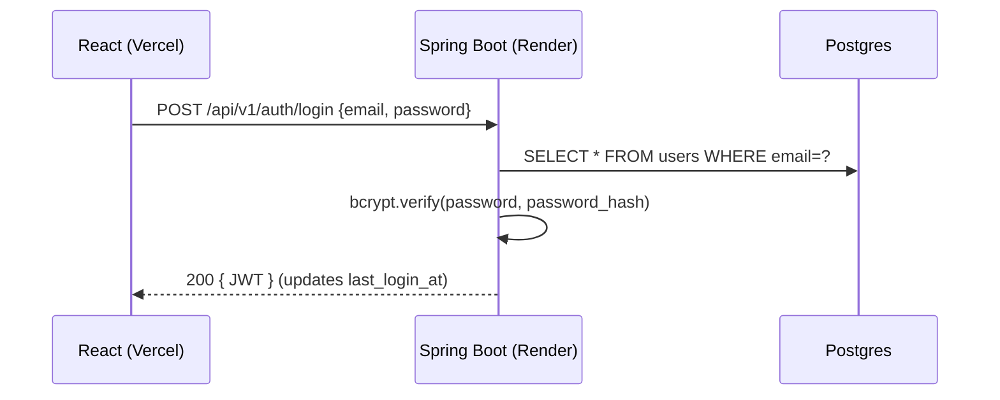
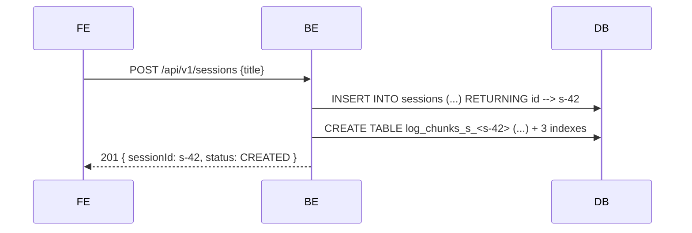
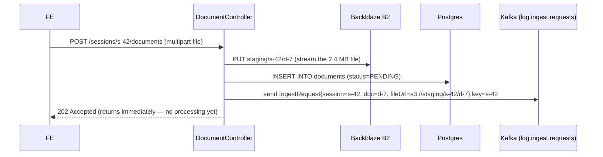
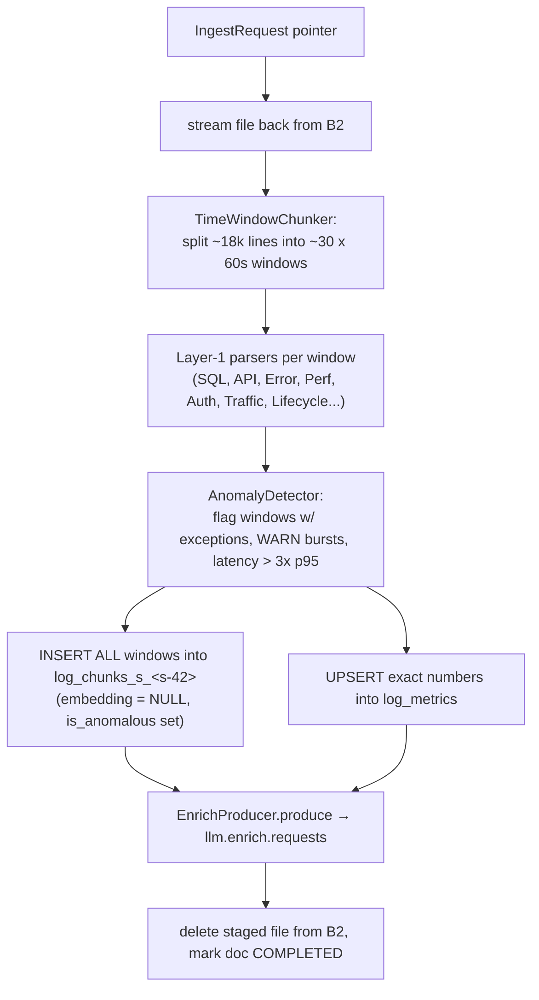
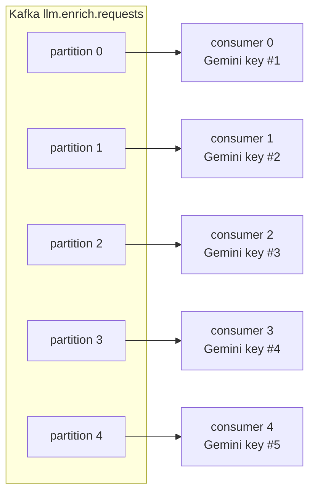
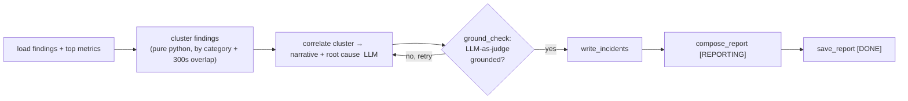
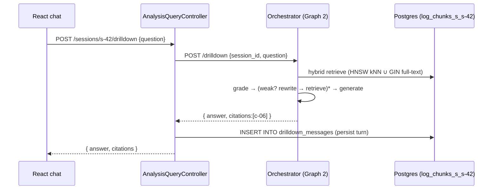
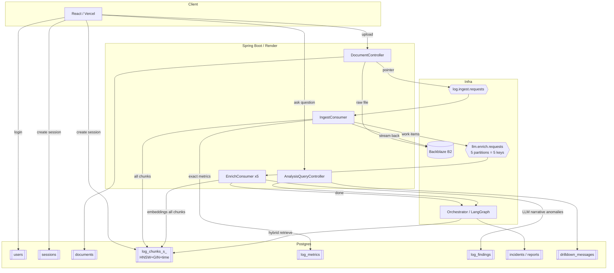

# Current Design — End-to-End Live Walkthrough

> **Purpose:** one document that shows *exactly how the system works today* (not the
> aspirational target) — every hop, every table, every index — traced through one
> concrete example, from **login → create session → upload a log file → processing →
> asking a question**. Use this to reason about what to change next.
>
> Everything here is taken from the actual code:
> `DocumentController`, `IngestConsumer`, `TimeWindowChunker`, `AnomalyDetector`,
> `EnrichProducer`/`EnrichConsumer`, `SessionChunkTableManager`,
> `SessionChunkRepository`, `schema-v2.sql`, and the Python `rag-orchestrator`
> (`graph_analyze.py`, `graph_drilldown.py`, `db.py`).

---

## 0. The cast (physical components)

| Component | Tech | Where it runs | Role |
|---|---|---|---|
| **Frontend** | React | Vercel (`deeploglens.vercel.app`) | Upload UI, progress (SSE), chat |
| **Backend** | Java 21 / Spring Boot | Render (`loglens-api-…`) | Auth, upload, ingest+enrich Kafka workers, query proxy |
| **Orchestrator** | Python / FastAPI / LangGraph | Render (`loglens-orchestrator`) | Graph 1 (correlation+report), Graph 2 (drill-down RAG) |
| **Kafka** | Redpanda Cloud | managed | Async work queue (2 lanes) |
| **Blob storage** | Backblaze B2 (S3 API, via MinIO client) | managed | Staging for the raw uploaded file |
| **Database** | PostgreSQL 16 + `pgvector` | Render (`loglens-db`) | All state + per-session vector tables |

**Two golden rules of the design (keep these in mind the whole way through):**
1. **The request path never touches an LLM or a GB of data.** Upload returns `202`
   in milliseconds; all heavy work is async behind Kafka.
2. **Every chunk is stored and embedded; only *anomalous* windows get an LLM
   narrative.** (This is the single most misunderstood part — see §5–§6.)

---

## 1. The example we'll trace

- **User:** `alice@corp.com`
- **Session:** "payments-api — prod — 16 Jul"
- **File:** `payments-api.log`, **2.4 MB, ~18,000 lines**, spanning **10:00 → 10:30** (30 min)
- At **10:05** there's a burst of `SQLException` + slow requests (a real incident).
- Later Alice asks: **"why did checkout fail around 10:05?"**

Assumptions the code uses: **60-second analysis windows**, embedding **batch size 10**
(the configured `loglens.embedding.batch-size`), **5 Gemini API keys** → 5 partitions on
the enrich lane.
30 minutes of logs → **~30 windows** (one per minute).

---

## 2. Login  →  `users` table

**`users`** (global table — one row per person):

| id (UUID, PK) | email (UNIQUE) | password_hash | full_name | last_login_at | is_active |
|---|---|---|---|---|---|
| `u-alice` | alice@corp.com | `$2a$…` | Alice R. | 2026-07-16 10:00 | true |

Indexes: `idx_users_email` on `email`.
The JWT (subject = `u-alice`) is sent as `Authorization: Bearer …` on every later call.

---

## 3. Create session  →  `sessions` row **+ a dedicated chunk table is provisioned**

This is the first architecturally distinctive step. Creating a session does **two**
things:

**`sessions`** (global — one row per corpus/workspace):

| id | user_id (FK→users) | title | analysis_status | total_windows | enriched_windows |
|---|---|---|---|---|---|
| `s-42` | `u-alice` | payments-api — prod — 16 Jul | `CREATED` | 0 | 0 |

- `analysis_status` walks a fixed state machine (the SSE progress bar reads it):
  `CREATED → CHUNKING → PARSING → ENRICHING → CORRELATING → REPORTING → DONE` (or `FAILED`).
- `total_windows` / `enriched_windows` = an **idempotent completion counter** (explained in §6).
- Index: `idx_sessions_user (user_id, updated_at DESC)` → fast "my sessions, newest first".

**The per-session chunk table** (`SessionChunkTableManager.createFor`) — table name is
`log_chunks_s_` + the UUID with `-`→`_`, e.g. `log_chunks_s_s_42…`. Built **only** from a
validated UUID (SQL-injection guard). Created **empty** with all three indexes up front:

**`log_chunks_s_<s-42>`** (one physical table *per session*):

| column | type | note |
|---|---|---|
| `chunk_id` | UUID PK | one row = one 60s window of logs |
| `document_id` | UUID | which uploaded file it came from |
| `time_bucket` | TIMESTAMPTZ | the minute this window covers |
| `line_start` / `line_end` | INTEGER | line range in the original file (for citations) |
| `content` | TEXT | the raw log lines of this window |
| `embedding` | **vector(768)** | filled later; **NULL at insert** |
| `is_anomalous` | BOOLEAN | set by the anomaly gate |
| `created_at` | TIMESTAMPTZ | |

Three indexes created immediately (empty now, populated as rows land):

| index | type | serves |
|---|---|---|
| `idx_lc_<tid>_hnsw` | **HNSW** on `embedding vector_cosine_ops` (m=16, ef_construction=64) | semantic kNN search |
| `idx_lc_<tid>_fts` | **GIN** on `to_tsvector('simple', content)` | keyword / full-text search |
| `idx_lc_<tid>_time` | B-tree on `time_bucket` | time-range filters |

> **Why a whole table per session?** So each corpus gets its **own right-sized HNSW
> index**. A single shared index over 250 services' vectors would force every query to
> do filtered-ANN (`WHERE session_id=…` *after* the vector scan), which wrecks recall
> and latency. Isolation = each search only ever walks its own graph. (Trade-off: many
> tables — the stated exit strategy is hash-partitioning if the table count grows.)

---

## 4. Upload the file  →  B2 blob  +  **one** Kafka reference message  →  `202`

Critical: the raw 2.4 MB file is **NOT** sent through Kafka. It goes to **blob storage**;
Kafka only carries a tiny pointer.

**`documents`** (global — one row per uploaded archive):

| id | session_id | original_file_name | file_url | file_size_bytes | processing_status | staged_file_deleted |
|---|---|---|---|---|---|---|
| `d-7` | `s-42` | payments-api.log | `s3://staging/s-42/d-7` | 2,411,008 | `PENDING` | false |

- Idempotency: `uq_doc_per_session (session_id, original_file_name, file_size_bytes)` —
  re-uploading the same file returns the existing row instead of reprocessing.
- The Kafka message is published **after** the DB row commits, so a consumer can never
  see a message for a row that isn't there.

**Kafka message on `log.ingest.requests`** (key = `s-42`): a ~120-byte JSON pointer, not the logs.

---

## 5. Ingest worker  →  chunk → parse → detect → **store every chunk** → fan out

The `IngestConsumer` (group `ingest-workers`) picks up the pointer, **streams the file
back from B2**, and runs the whole Layer-1 pipeline. Status flips
`CHUNKING → PARSING → ENRICHING` as it goes (SSE updates the progress bar live).

### 5a. Chunking
`TimeWindowChunker` groups lines into 60-second buckets. Multi-line stack traces stay
with their parent line. Result: **~30 windows**, each a `LogWindow{ chunkId, timeBucket,
lineStart, lineEnd, content, isAnomalous=false }`.

### 5b. Parsing (Layer 1 — deterministic, no LLM)
Each window is run through **every** parser. These compute **exact** numbers
(counts, sums, p95 latency) — *computed, never generated by an LLM*. Example output for
the 10:05 window: `{category=DATABASE, metric=sql_failures, count=14}`,
`{category=PERFORMANCE, metric=http_latency, p95_ms=4200}`.

### 5c. Anomaly detection (the gate)
`AnomalyDetector` marks a window `is_anomalous = true` if it has an intrinsic problem
(exception / OOM / deadlock) **or** ≥5 WARN lines **or** latency > 3× the corpus p95.
In our file, the **10:05 window** trips it; the other ~29 are normal.

### 5d. Storage — **ALL chunks, not just anomalies**

`SessionChunkRepository.insertBatch` writes **every** window into the per-session table
(500 rows/batch). This is the point people get wrong: normal windows are stored too —
they're just marked `is_anomalous=false`. You need them so the RAG chat in §8 can answer
questions about *any* part of the log, not only incidents.

**`log_chunks_s_<s-42>`** after ingest (embeddings still NULL):

| chunk_id | time_bucket | line_start–end | content (excerpt) | embedding | is_anomalous |
|---|---|---|---|---|---|
| `c-01` | 10:00 | 1–540 | `...INFO request ok...` | NULL | false |
| … | … | … | … | NULL | false |
| **`c-06`** | **10:05** | **3200–3980** | `...SQLException: deadlock... 14x...` | NULL | **true** |
| … | … | … | … | NULL | false |
| `c-30` | 10:29 | 17800–18000 | `...INFO shutdown...` | NULL | false |

**`log_metrics`** (global, keyed for idempotent upsert) — the exact numbers:

| session_id | time_bucket | category | metric | count | p95_ms | sample_chunk_ids |
|---|---|---|---|---|---|---|
| s-42 | 10:05 | DATABASE | sql_failures | 14 | – | {c-06} |
| s-42 | 10:05 | PERFORMANCE | http_latency | 512 | 4200 | {c-06} |
| s-42 | 10:01 | API | ff_api_calls | 300 | 90 | {c-01} |

PK `(session_id, time_bucket, category, metric)` → a redelivered Kafka message upserts the
same row instead of double-counting. Index: `idx_metrics_session_cat`.

### 5e. Fan-out to the enrich lane
`EnrichProducer.produce` emits work items to **`llm.enrich.requests`**:
- **1 × `ENRICH_WINDOW`** per **anomalous** window → here **1** (only `c-06`).
- **1 × `EMBED_BATCH`** per **10 chunks across ALL windows** → 30 chunks → **3** batches.

So `total_windows` (the completion target) = anomalous(1) + embedBatches(3) = **4 work items**.
It's set on the session **before** producing, so the counter has a correct target immediately.
Then the staged file is **deleted from B2** (`staged_file_deleted=true`) and the document is
marked `COMPLETED`.

---

## 6. Enrich workers  →  embeddings (all chunks) + narratives (anomalies) — **partition-per-key**

This is the LLM lane. `EnrichConsumer` (group `llm-workers`) runs with
**concurrency = number of API keys = 5**, and the topic has **5 partitions**. Work items
are spread by a hash of their `workId`, so **each partition ≈ one Gemini key**, and each
consumer self-paces to *its own* key's rate limit — **no shared rate-limit coordination**.

Two kinds of work item:

| Work item | What the worker does | Writes to |
|---|---|---|
| **`EMBED_BATCH`** (all chunks) | read chunk `content`, call Gemini `gemini-embedding-001` (outputDim **768**), get vectors | `UPDATE log_chunks_s_<s-42> SET embedding = ?::vector WHERE chunk_id = ?` |
| **`ENRICH_WINDOW`** (anomalies only) | send the anomalous window to **Groq** LLM → structured insight (title, explanation, severity) | `INSERT INTO log_findings` (deduped by fingerprint) |

After this stage, **`log_chunks_s_<s-42>.embedding` is populated for every row** (the HNSW
index now has 30 vectors), and `log_findings` has the incident insight:

**`log_findings`** (Layer-2 LLM output, grounded to chunk ids):

| id | session_id | category | severity | title | evidence_chunk_ids | fingerprint | occurrence_count |
|---|---|---|---|---|---|---|---|
| `f-1` | s-42 | DATABASE | CRITICAL | "Deadlock storm on checkout" | {c-06} | `sha…` | 1 |

- `uq_finding_fingerprint (session_id, fingerprint)` → the *same* anomaly seen again just
  bumps `occurrence_count`, no duplicate row.

**Backpressure / reliability on this lane:**
- A Gemini 429 → the item is parked on `llm.enrich.retry.60s` and re-released after a delay
  (it doesn't block the partition).
- Exhausted retries / poison → `llm.enrich.dlq`.
- `enable-auto-commit=false` + manual ack → an offset is committed **only after** the DB
  write, so delivery is **at-least-once** and a crash just redelivers.
- **Completion counter:** every terminal work item increments `enriched_windows`. When
  `enriched_windows == total_windows`, `EnrichCompletion` flips the session to
  `CORRELATING` and calls the orchestrator (§7).

> ⚠️ **Known live bug you just fixed:** `max.poll.records` defaulted to 500 while each
> `EMBED_BATCH` can block up to ~90s in `EmbeddingKeyPool.acquire()`, so a poll batch blew
> past `max.poll.interval.ms` → rebalance storm → offsets never committed → **embeddings
> stayed NULL**. Fix: `max.poll.records=1`. (Requires a Render redeploy to take effect.)

---

## 7. Correlation & report  →  LangGraph **Graph 1**  →  `incidents` + `reports`

When enrichment finishes, the Java side flips status to `CORRELATING` and `POST`s to the
orchestrator: `POST /analyze/s-42` (returns `202`; runs in the background).

**Graph 1** (`graph_analyze.py`):
`load → cluster → (correlate → ground_check)* → write_incidents → compose_report → save_report`

- **Clustering is pure Python** (no LLM): findings in the same category whose time ranges
  overlap within 300s become one incident.
- **`ground_check` is an LLM-as-judge loop with a bounded recursion budget** sized to the
  finding count — regenerate-or-accept per cluster so a narrative can't hallucinate beyond
  its evidence. *This cyclic, conditional control flow is exactly why LangGraph is used
  here instead of a straight-line chain.*

Writes:

**`incidents`**: `{ session_id=s-42, time_range=10:05–10:07, finding_ids={f-1}, narrative="A deadlock storm…", root_cause_hypothesis="…" }`
**`reports`** (one per session, PK=session_id): `content_md` + `content_json`.

Session status → **`DONE`**. The SSE stream tells the frontend to render metrics charts,
findings, incidents, and the report.

---

## 8. Alice asks a question  →  LangGraph **Graph 2** (corrective-RAG)

Now the interactive part. Alice types **"why did checkout fail around 10:05?"** in the chat.

**Graph 2** (`graph_drilldown.py`): `retrieve → grade → (weak? rewrite → retrieve)* → generate`

1. **retrieve** (`db.retrieve_chunks`) — **hybrid recall** over *only this session's* table:
   - embed the question (Gemini) → **HNSW kNN**:
     `ORDER BY embedding <=> %s::vector LIMIT k` (cosine) — uses `idx_lc_<tid>_hnsw`.
   - **GIN full-text**:
     `to_tsvector('simple',content) @@ websearch_to_tsquery(...)` — uses `idx_lc_<tid>_fts`.
   - **UNION, de-duplicated by `chunk_id`.** (Fallback: if FTS's AND-match finds nothing,
     retry with an OR of the terms; if there's no embedding, FTS-only.)
2. **grade** — an LLM judges which retrieved chunks are actually relevant.
3. **rewrite** — if the grade is weak, rewrite the question and retrieve again (bounded by
   `MAX_REWRITES`). A remembered `best_docs` guarantees we never answer from nothing.
4. **generate** — answer **grounded strictly in the retrieved chunks**, returning the
   **`chunk_id`s it cited** (e.g. `c-06`). *The retry/rewrite cycle is the "corrective" in
   corrective-RAG — again, a graph, not a linear chain.*

For our question, retrieval surfaces **`c-06`** (the 10:05 deadlock window) via both the
vector and keyword paths; the answer cites it, and the frontend can show the exact log
lines (`line_start–line_end` → the original file range).

**`drilldown_messages`** (persisted so chat history survives reload/logout):

| id | session_id | question | answer | citations | created_at |
|---|---|---|---|---|---|
| `m-1` | s-42 | why did checkout fail around 10:05? | "A database deadlock storm…" | {c-06} | 10:32 |

Index: `idx_drilldown_session (session_id, created_at)`.

---

## 9. The whole picture on one page

---

## 10. Table map (which table holds what, and its indexes)

| Table | Scope | Holds | Key indexes | Written by |
|---|---|---|---|---|
| `users` | global | accounts | `idx_users_email` | auth |
| `sessions` | global | one corpus/workspace + status + completion counter | `idx_sessions_user` | API |
| `documents` | global | one uploaded file, blob URL, status | `idx_documents_session`, `uq_doc_per_session` | upload |
| **`log_chunks_s_<id>`** | **per session** | every 60s window: content + `vector(768)` + anomaly flag | **HNSW**(embedding), **GIN**(content FTS), B-tree(time) | ingest (rows) + enrich (embeddings) |
| `log_metrics` | global | exact Layer-1 numbers per window | `idx_metrics_session_cat`, PK upsert | ingest |
| `log_findings` | global | Layer-2 LLM insights, grounded | `idx_findings_session`, `uq_finding_fingerprint` | enrich |
| `incidents` | global | correlated episodes (Graph 1) | `idx_incidents_session` | orchestrator |
| `reports` | global | one final report per session | PK=session_id | orchestrator |
| `drilldown_messages` | global | persisted Q&A chat (Graph 2) | `idx_drilldown_session` | query |

---

## 11. Fast facts to anchor decisions

- **Two Kafka lanes, never raw logs:** `log.ingest.requests` (pointer) and
  `llm.enrich.requests` (chunk-id work items, 5 partitions). Each has a DLQ; enrich also
  has a `retry.60s` topic.
- **Blob storage is staging only:** the file is deleted after successful ingest
  (`staged_file_deleted=true`). Postgres is the durable store from then on.
- **Two independent bursts:** embeddings scale with **log volume** (every chunk),
  narratives scale with **anomalies** (~10–15% of windows). The gate keeps the *expensive*
  LLM bounded even when volume explodes.
- **At-least-once everywhere:** manual offset commit after the DB write; every write is
  idempotent (upsert keys / fingerprints / duplicate-doc constraint) so redelivery is safe.
- **Per-session table = per-session HNSW.** Biggest structural bet; exit strategy is hash
  partitioning if table count becomes a problem.
- **LangGraph is used for the two places that need cycles + conditional routing:** the
  ground-check loop (Graph 1) and the grade→rewrite→re-retrieve loop (Graph 2). Everything
  deterministic (chunking, parsing, clustering) is plain code, no graph.

## 12. Honest current-state caveats (for your decisions)

- **Ingest loads the whole file into heap** (`readAllLines` → `List<String>`). Fine for
  MB files; a true multi-GB file would OOM. "Streaming, memory-safe ingest" is *not* true
  yet — it's a code change (stream window-by-window) if you want to claim it.
- **Embedding throughput is the real ceiling** on free tier (~6k chunks/hr across 5 keys);
  10⁶-chunk corpora need a paid tier or a local embed model — architecture unchanged.
- **`max.poll.records=1` fix** must be deployed (Render redeploy) for embeddings to persist.
