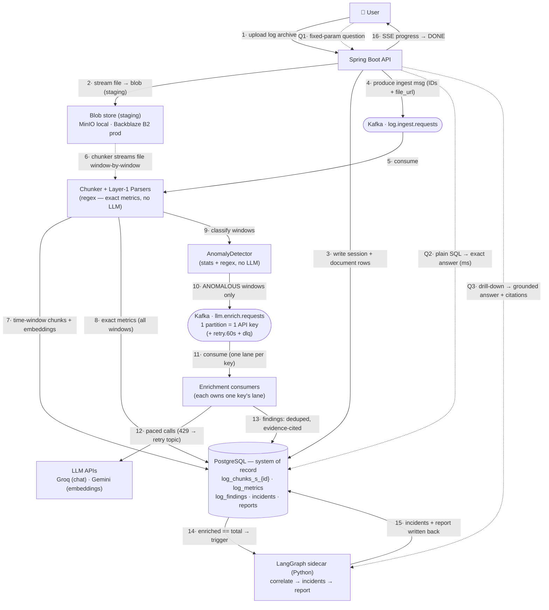

# 01 — Data Flow: the whiteboard walk-through

This is the diagram to reproduce on a whiteboard, plus the *one sentence per
arrow* that explains **why that step exists** — not just what it does. If you can
draw this and say the "why" column out loud, you can defend the whole system.

---

## The diagram

**How to read it in one breath:** *1–8 get raw material in (upload → blob →
Kafka → chunks + exact metrics). 9–13 are the LLM burst — filtered to anomalies,
buffered by Kafka, paced per key. 14–15 turn findings into a story, once. 16 the
user watched it all over SSE. Q1–Q3: questions are answered from tables, no LLM,
except the drill-down.*

---

## Every step, and *why it exists*

| # | What happens | **Why this step exists** (the sentence that matters) |
|---|---|---|
| 1 | User uploads a log archive into a **session** | A session = one corpus (one incident's logs, one service-day). It's a workspace, not a chat — that framing is why per-session physical isolation later makes sense. |
| 2 | API **streams** the file to the blob store (staging) | Decouples the slow upload from processing. The HTTP call returns immediately; everything after is async. Streaming (not buffering) means a multi-GB archive never sits in JVM heap. |
| 3 | API writes `sessions` + `documents` rows | Postgres is the source of truth from the first millisecond. The status column is what SSE will stream. |
| 4 | API produces one small message to `log.ingest.requests` | The message carries **IDs + `file_url`, never the file bytes**. Kafka moves references, not blobs — keeps the broker cheap and messages small. |
| 5 | Chunker consumes the message | Kafka is the hand-off from the synchronous web tier to the async worker tier. Crash here = message redelivered, not lost. |
| 6 | Chunker **streams the file back from blob**, window by window | Never loads the whole archive in memory. Windows are **time-based (60s)**, not size-based — logs are temporal, and time windows align 1:1 with metric buckets. |
| 7 | Writes time-window chunks + embeddings → `log_chunks_s_{id}` | This is the **durable evidence layer**. Once written, the staged file is redundant and gets deleted (`staged_file_deleted = true`). Everything else in the system cites into these rows. |
| 8 | **Layer-1 parsers** run on *every* window → `log_metrics` | Pure regex/Java. Exact counts, latencies (avg/p95), status codes. This is where "how many SQL failures?" gets a **parser-exact** answer — an LLM is never asked to count. |
| 9–10 | `AnomalyDetector` flags each window; **only anomalous ones** go to `llm.enrich.requests` | This filter is the cost lever: 10,000 windows ≠ 10,000 LLM calls. A window is anomalous if a parser sees an intrinsic problem (exception/OOM/deadlock), OR ≥5 WARN lines, OR latency > 3× the corpus p95. Boring windows stop here — **zero LLM cost.** |
| 11 | Enrichment consumers pick up their partition — **one partition per API key** | Kafka guarantees one consumer per partition per group, so per-key rate pacing needs no cross-thread coordination. Partition *i* ↔ key *i*. |
| 12 | Each consumer calls the LLM, paced to its key's quota; 429 → `retry.60s`; repeated failure → `dlq` | The burst is absorbed by **Kafka lag**, not by user-facing errors. On 429 the consumer publishes to the retry topic and moves on — no thread parked for 60s. |
| 13 | LLM output → `log_findings`: severity-tagged, **fingerprint-deduplicated**, with `evidence_chunk_ids` | Grounded at write time. The same anomaly seen twice does `count++`, not a new row. Every insight points back to the exact log lines that prove it. |
| 14 | Session's idempotent `enriched_windows` counter reaches `total_windows` → triggers LangGraph | A **counter, not a coordinator** — safe under at-least-once redelivery. No distributed lock needed to know "analysis is done." |
| 15 | LangGraph **Graph 1**: cluster findings (deterministic) → correlate each cluster (LLM) → groundedness-check → write `incidents` → compose `report` | The only place cross-window reasoning happens, and it runs **once per corpus**. Loops are budgeted (max 2 regenerations). |
| 16 | Status hits `DONE`; UI followed via SSE reading the status row | No status topic — the DB row (`CHUNKING → PARSING → ENRICHING n/m → CORRELATING → REPORTING → DONE`) is the single source of truth. |
| Q1–Q2 | Fixed-param question → plain SQL over `log_metrics` / `log_findings` / `incidents` | **Milliseconds, exact, no LLM in the loop.** Hallucination-proof by construction — the LLM already did its work at ingest time. |
| Q3 | "Show me the actual lines" → LangGraph **Graph 2** searches *this session's* chunk table (pgvector + GIN) | The only query-time LLM path, and it cites line-level evidence. This is classic query-time RAG, kept as the escape hatch. |

---

## The single insight behind the whole flow

**The LLM work moved left of the query.** Standard RAG does `embed query → top-k
→ generate` at *question* time and structurally fails on whole-corpus questions
(the answer is spread across thousands of chunks; no top-k holds it). LogLens
does the analysis **once, at ingest**, materializes typed findings, and then
answers questions from tables. GraphRAG makes the same move — you're in good
company, and you should name it.

Continue to [`02-design-defense.md`](02-design-defense.md) to defend each box
with numbers.
