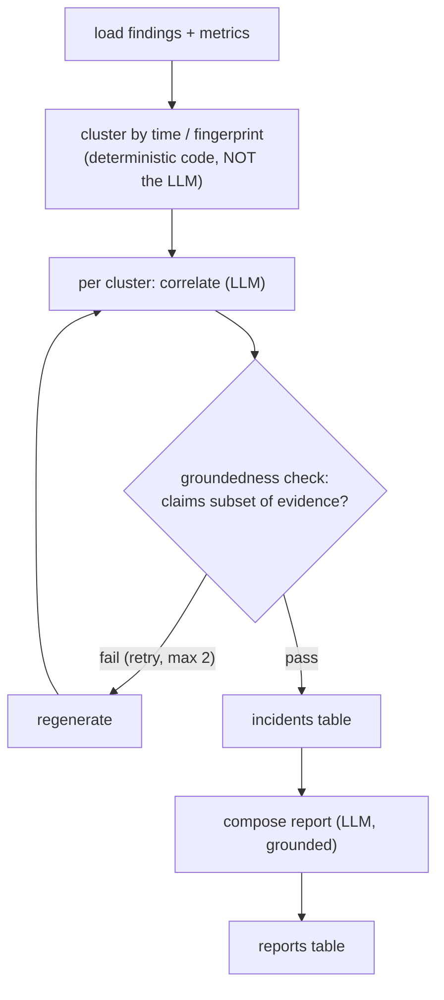
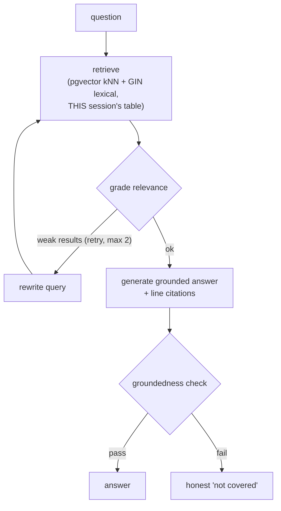

# 04 — Questions you might miss (incl. "why graphs?")

The questions that catch people out: the purpose of the graphs, the weak spot in
the anomaly filter, failure modes, the cost model, security, and testing. Each
has a short, defensible answer.

---

## A. "Why LangGraph / why a *graph* at all? Why not a simple chain?"

**The core answer: a chain is a DAG; self-correction is a cycle.** You need a
graph the moment a step can send you *backwards*.

There are **two graphs**, each with a loop that a linear chain can't express:

### Graph 1 — correlate & report (runs once per corpus)

**The cycle:** if the correlation LLM makes a claim not supported by the evidence
findings, the groundedness check *fails the node and loops back to regenerate*
(budgeted to 2 tries). A chain can't loop; a graph can. That loop is the
anti-hallucination guarantee.

### Graph 2 — evidence drill-down (on demand, session-scoped)

**The cycle:** if retrieval returns weak/irrelevant chunks, the graph *rewrites
the query and retries* rather than answering from thin evidence. Again — a loop.

**Say this:** *"I use a graph, not a chain, because both flows have
cycles-with-budgets: retrieve→grade→rewrite→retry, and generate→groundedness-
check→regenerate. A chain is a straight line; self-correction needs to go
backwards. The library is LangGraph but the pattern is a budgeted state machine —
I could implement it in Java."*

**The honest footnote** (from doc 03): the graph *pattern* is essential; the
*Python sidecar* that hosts it is the debatable part.

---

## B. "What's the weak spot in your anomaly filter?" (they may not ask — volunteer it)

The `AnomalyDetector` flags a window if: a parser sees an intrinsic problem
(exception/OOM/deadlock/failed health check) **OR** ≥5 WARN lines **OR** a latency
metric > 3× the corpus-wide p95.

**The honest weakness:** it's **keyword/statistics-based, so it can miss a
*semantic* anomaly** that uses no WARN/ERROR keyword and blows no latency
threshold — e.g. a successful-looking sequence of requests that is logically
wrong (a retry storm that all returns 200s, a silent data corruption). The filter
trades recall for cost: it will *never* over-spend the LLM, but it *can*
under-detect subtle issues.

**Why the trade is right anyway:** the alternative — sending every window to the
LLM to judge "interesting?" — reintroduces exactly the unbounded-cost problem the
whole design exists to avoid. And parser-intrinsic detection catches the vast
majority of *operationally* significant events (the things that page an on-call).

**The mitigation I'd add:** make the anomaly rules extensible and **replayable** —
a new detector version re-consumes the topic and re-flags, so missed anomalies
are recoverable without re-uploading. That's the payoff of Kafka replay.

---

## C. "What happens on failure / crash mid-analysis?"

- **Crash between web tier and chunker:** the ingest message is redelivered
  (at-least-once). No data loss.
- **Crash mid-enrichment:** re-consumed messages re-run; **idempotent handlers**
  make this safe — findings dedup on `fingerprint`, metrics upsert on
  `(session_id, time_bucket, category, metric)`. Re-processing a window produces
  the same rows, not duplicates.
- **429 / rate limit:** message → `retry.60s` topic; after N retries → `dlq` for
  manual inspection + replay. The consumer never blocks.
- **"Is analysis done?"** is an **idempotent counter** (`enriched_windows ==
  total_windows`), not a distributed lock — safe under redelivery.
- **Everything derived is rebuildable** from Postgres + the raw chunks. The
  chunks themselves are the only precious data, and they're written before the
  staged file is deleted.

**Say this:** *"At-least-once delivery + idempotent handlers via natural keys.
I chose this over Kafka exactly-once transactions because for upsert/dedup write
shapes it gives equivalent correctness far more simply."*

---

## D. "What's the cost model? Give me numbers."

The whole design is a **cost-control argument**. Walk the levers:

| Lever | Effect |
|---|---|
| **Parsers do all counting** | The exact-numbers path (`log_metrics`) costs **$0 in LLM** — it's regex. |
| **Anomaly gate** | Only anomalous windows reach the LLM. 10,000 windows might send a few hundred → the LLM bill is a *fraction* of the corpus size, not proportional to it. |
| **Fingerprint dedup** | A repeated exception is `count++`, not a fresh LLM call — recurring errors don't multiply cost. |
| **Analysis once, query many** | The LLM burst happens *once* at ingest. Every subsequent question is SQL (ms, $0). A chat-over-logs app re-pays LLM cost on *every* question. |
| **Free-tier rate math** | Gemini embeddings: 30K TPM/key; a chunk ≈ 1,500 tokens; 5 independent-account keys ≈ 150K TPM → the corpus embeds within free limits by round-robin. |
| **$0 infra** | Render free web + Postgres, Redpanda Serverless free, Backblaze B2 (cheapest S3-compatible), Vercel free frontend. |

**The killer comparison:** *"Ask-the-LLM-every-question re-pays inference on every
query and can't answer whole-corpus questions at all. I pay the LLM once at
ingest, materialize findings, and answer from tables forever after. Cost scales
with *corpus size*, not with *question volume*."*

---

## E. "Isn't this just Splunk / ELK? Why not use them?"

**They find lines; this explains them.** Splunk/ELK are excellent at
*retrieval* — "show me every line matching X." LogLens's output is a **root-cause
narrative with citations** — "a deploy at 14:02 exhausted the connection pool,
causing 340 SQL timeouts and the 5xx spike, here are the exact lines." It's a
*reasoning layer over the same data*, not a competitor to the search layer.

---

## F. "Why not just use a 1M-token context window and skip all this?"

Three reasons: **(1)** corpus archives exceed even 1M tokens; **(2)** long-context
recall degrades ("lost in the middle") — accuracy drops for facts buried mid-
context; **(3)** cost — a full-context read *per question* vs. once-per-corpus
enrichment. **Materialization scales unboundedly; a context window doesn't.**

---

## G. "Is this even still RAG?"

**Yes — ingest-time RAG.** Every enrichment call is generation *grounded in
retrieved log evidence* with citations; the report is grounded in findings;
drill-down is classic query-time RAG. The retrieve→ground→generate loop didn't
disappear — it **moved left of the query.** GraphRAG and RAPTOR make the same
index-time move; I additionally materialize *typed, structured* findings rather
than prose summaries.

---

## H. Security (they'll poke at the runtime `CREATE TABLE`)

- **Table names are UUID-only.** Generated from validated session UUIDs, never
  from user input — no string reaches the DDL. SQL-injection surface closed.
- **Auth:** Spring Security + JWT (stateless); passwords BCrypt-hashed, never
  plaintext.
- **Tenant isolation:** per-session tables are physically isolated; query paths
  are always session-scoped.
- **Secrets:** API keys via env vars, never committed. (CORS locked to the known
  frontend origin.)

---

## I. "How would you test this?"

- **Golden-corpus regression set:** a fixed log archive with a *known* expected
  set of metrics/findings/incidents. Re-run the pipeline, diff the output — catches
  extractor regressions.
- **Parser unit tests:** deterministic, so trivially testable with fixture lines.
- **Idempotency test:** replay the same messages, assert no duplicate rows.
- **Groundedness metric:** track the % of LLM claims that pass the evidence check
  — a quality signal you can regression-test.

---

## J. Rapid-fire one-liners (memorize)

| Q | A |
|---|---|
| Why time-window chunks, not size? | Logs are temporal; time windows align 1:1 with metric buckets. |
| Why 60-second windows? | Fine enough to localize an incident, coarse enough to bound window count. Tunable. |
| pgvector top-k? | `ORDER BY embedding <=> :q LIMIT k` over HNSW — SQL *is* the top-k API. |
| When is HNSW pointless? | Under ~10k rows exact scan wins and is exact. |
| Exactly-once? | At-least-once + idempotent handlers via natural keys — equivalent, simpler. |
| Biggest risk? | Operational surface (Postgres + Kafka + 2 services) for a portfolio app — already reduced by cutting ES and S3; everything derived is rebuildable. |
| Why two deployables? | Only because the Python AI ecosystem forces the sidecar; everything else is one Java monolith. |
| SSE vs WebSocket? | Progress is one-directional server→client; SSE is the simpler correct tool. |

---

**End of pack.** Rehearse the four docs in order: draw doc 01, defend with doc 02
numbers, *volunteer* doc 03's self-critique, and keep doc 04 in your back pocket
for the follow-ups.
